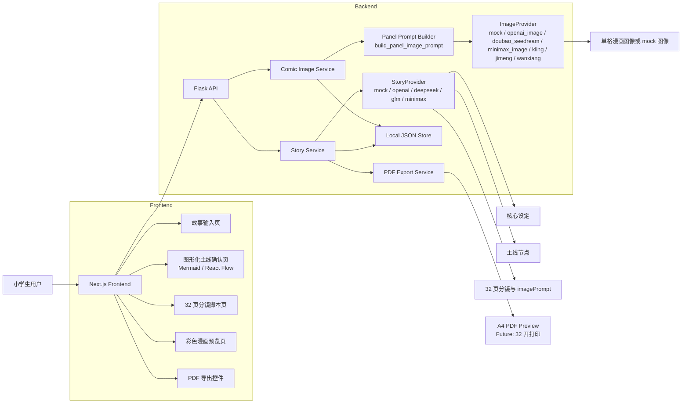

# 技术架构

## 技术栈

- frontend: Next.js + TypeScript + TailwindCSS
- UI: shadcn/ui，可选 React Flow
- backend: Flask + Python 3.11
- data: 本地 JSON 文件
- AI: mock provider；M7 后拆分为 StoryProvider 与 ImageProvider；M11 已加入 Panel Prompt Builder
- PDF: 前期可用浏览器打印或后端 PDF 库

## 架构原则

- 前端负责流程体验、图形化主线确认、分镜预览和 PDF 预览入口。
- 后端负责 mock 生成、数据持久化、导出任务和未来真实 provider 适配。
- AI 能力通过 provider interface 隔离，MVP 不直接绑定真实模型。
- StoryProvider 负责文本结构生成，ImageProvider 负责分镜图像生成，两者不得互相越界。
- 本地 JSON 是 MVP 的单一数据源，后续可迁移到 SQLite 或云端数据库。
- PDF 输出必须使用漫画结构数据，不得直接把故事文本拼成纯文本 PDF。

## 系统架构图



## 推荐目录结构

```text
frontend/
  app/
  components/
    story/
    timeline/
    script/
    comic/
    export/
  lib/
    api/
    types/

backend/
    app/
    api/
    services/
    providers/
      story/
      image/
    storage/
    export/
  data/

docs/
```

## 关键模块

- Story Input: 收集故事概念，不进入聊天模式。
- Outline Generator: 生成核心设定，包括主题、角色、风格和儿童适龄改写。
- Timeline Generator: 生成图形化主线节点。
- Timeline Editor: 用户确认或编辑主线。
- Script Generator: 生成固定 32 页漫画脚本。
- StoryProvider: 生成核心设定、主线、32 页分镜和每格 `imagePrompt`。
- Panel Prompt Builder: 基于 `story/page/panel` 构建单格漫画图片 prompt，融合角色设定、分镜结构、中文对白气泡和儿童安全约束；对白气泡内只写对白文本，角色归属由气泡尾巴或指向线表达。
- ImageProvider: 根据 Panel Prompt Builder 输出的 prompt 生成漫画图像或 mock 图像占位数据。
- Image Asset Cache: 图片资产层，保存真实生图历史产物、promptHash、候选图和 `selectedImageId`。
- Comic Preview: 以漫画页方式展示图片、对白、旁白和页码；M12 已支持把选中的真实图片渲染到对应分镜框。
- PDF Export: 导出 A4 预览 PDF，M12 已支持嵌入选中的真实分镜图片，后续升级 32 开打印。
- Batch Generation Queue: 一键自动化任务层，负责缓存命中、预算限制、状态追踪、失败重试、候选图挑选和单格重生成。
- Local Project/Budget Model: M14 规划的本地项目层，用 `workspaceId=local_default`、`projectId` 管理故事、缓存和预算，不引入正式账号系统。

## M7 Provider 配置原则

```text
STORY_PROVIDER=mock
IMAGE_PROVIDER=mock
```

- `StoryProvider` 可接入文本模型，例如 OpenAI、DeepSeek、GLM、MiniMax。
- `ImageProvider` 可接入图像模型，例如 OpenAI Images、MiniMax Image、可灵、即梦、通义万相。
- DeepSeek 这类纯文本模型不得作为 ImageProvider 使用。
- 所有 provider 输出必须经过服务层结构校验，模型不能决定页数、跳过主线确认或改变 PDF 目标。

## 真实 API 接入路线

- M7: 只拆分 StoryProvider 与 ImageProvider，默认仍使用 mock。
- M8: 只接入一个真实 StoryProvider，用于文本结构生成和 `imagePrompt`。
- M9: 只接入一个真实 ImageProvider，优先单 panel 或单页生成。
- M10: 稳定真实工作流，补齐 fallback、缓存、错误处理、调用次数限制和测试。
- M11: 新增统一 Panel Prompt Builder，真实 ImageProvider 不再直接原样消费 `panel.imagePrompt`。
- M12: Image Asset Cache、候选图管理、真实图片进入前端预览和 PDF 分镜框。
- M13: 基于缓存的批量生成队列和一键自动化，允许单格 prompt 调整、候选图挑选和结果重生成。
- M14: 故事优先页数与本地项目/预算模型，用 bounded 规则替代固定 32 页。

真实 API key 只允许通过后端环境变量读取：

```text
STORY_PROVIDER=mock
IMAGE_PROVIDER=mock
OPENAI_API_KEY=
DEEPSEEK_API_KEY=
GLM_API_KEY=
MINIMAX_API_KEY=
```

前端不得读取、传输或展示任何 provider key。
