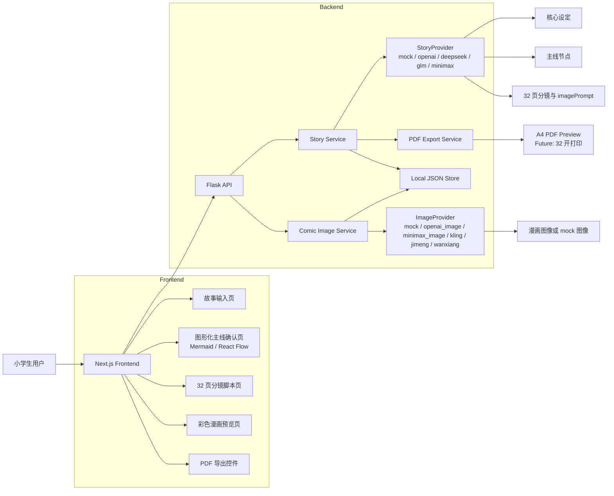

# 技术架构

## 技术栈

- frontend: Next.js + TypeScript + TailwindCSS
- UI: shadcn/ui，可选 React Flow
- backend: Flask + Python 3.11
- data: 本地 JSON 文件
- AI: mock provider；M7 后拆分为 StoryProvider 与 ImageProvider
- PDF: 前期可用浏览器打印或后端 PDF 库

## 架构原则

- 前端负责流程体验、图形化主线确认、分镜预览和 PDF 预览入口。
- 后端负责 mock 生成、数据持久化、导出任务和未来真实 provider 适配。
- AI 能力通过 provider interface 隔离，MVP 不直接绑定真实模型。
- StoryProvider 负责文本结构生成，ImageProvider 负责分镜图像生成，两者不得互相越界。
- 本地 JSON 是 MVP 的单一数据源，后续可迁移到 SQLite 或云端数据库。
- PDF 输出必须使用漫画结构数据，不得直接把故事文本拼成纯文本 PDF。

## 系统架构图



## 推荐目录结构

```text
frontend/
  app/
  components/
    story/
    timeline/
    script/
    comic/
    export/
  lib/
    api/
    types/

backend/
    app/
    api/
    services/
    providers/
      story/
      image/
    storage/
    export/
  data/

docs/
```

## 关键模块

- Story Input: 收集故事概念，不进入聊天模式。
- Outline Generator: 生成核心设定，包括主题、角色、风格和儿童适龄改写。
- Timeline Generator: 生成图形化主线节点。
- Timeline Editor: 用户确认或编辑主线。
- Script Generator: 生成固定 32 页漫画脚本。
- StoryProvider: 生成核心设定、主线、32 页分镜和每格 `imagePrompt`。
- ImageProvider: 根据分镜 `imagePrompt` 生成漫画图像或 mock 图像占位数据。
- Comic Preview: 以漫画页方式展示图片、对白、旁白和页码。
- PDF Export: 导出 A4 预览 PDF，后续升级 32 开打印。

## M7 Provider 配置原则

```text
STORY_PROVIDER=mock
IMAGE_PROVIDER=mock
```

- `StoryProvider` 可接入文本模型，例如 OpenAI、DeepSeek、GLM、MiniMax。
- `ImageProvider` 可接入图像模型，例如 OpenAI Images、MiniMax Image、可灵、即梦、通义万相。
- DeepSeek 这类纯文本模型不得作为 ImageProvider 使用。
- 所有 provider 输出必须经过服务层结构校验，模型不能决定页数、跳过主线确认或改变 PDF 目标。
