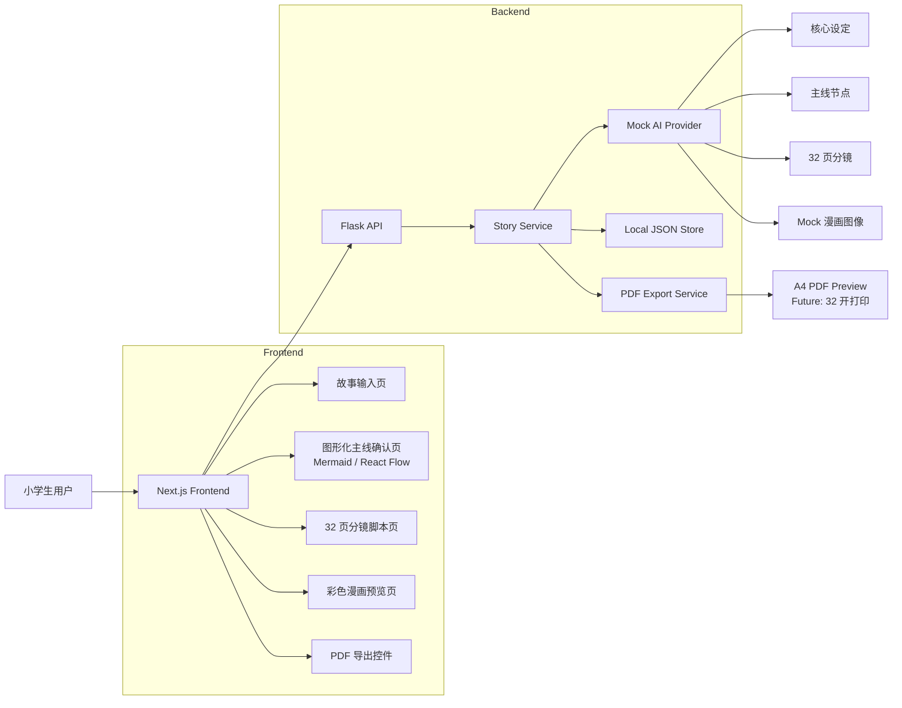

# 技术架构

## 技术栈

- frontend: Next.js + TypeScript + TailwindCSS
- UI: shadcn/ui，可选 React Flow
- backend: Flask + Python 3.11
- data: 本地 JSON 文件
- AI: mock provider
- PDF: 前期可用浏览器打印或后端 PDF 库

## 架构原则

- 前端负责流程体验、图形化主线确认、分镜预览和 PDF 预览入口。
- 后端负责 mock 生成、数据持久化、导出任务和未来真实 AI provider 适配。
- AI 能力通过 provider interface 隔离，MVP 不直接绑定真实模型。
- 本地 JSON 是 MVP 的单一数据源，后续可迁移到 SQLite 或云端数据库。
- PDF 输出必须使用漫画结构数据，不得直接把故事文本拼成纯文本 PDF。

## 系统架构图



## 推荐目录结构

```text
frontend/
  app/
  components/
    story/
    timeline/
    script/
    comic/
    export/
  lib/
    api/
    types/

backend/
  app/
    api/
    services/
    providers/
    storage/
    export/
  data/

docs/
```

## 关键模块

- Story Input: 收集故事概念，不进入聊天模式。
- Outline Generator: 生成核心设定，包括主题、角色、风格和儿童适龄改写。
- Timeline Generator: 生成图形化主线节点。
- Timeline Editor: 用户确认或编辑主线。
- Script Generator: 生成固定 32 页漫画脚本。
- Mock Image Generator: 为每个分镜生成 mock 图像占位数据。
- Comic Preview: 以漫画页方式展示图片、对白、旁白和页码。
- PDF Export: 导出 A4 预览 PDF，后续升级 32 开打印。
