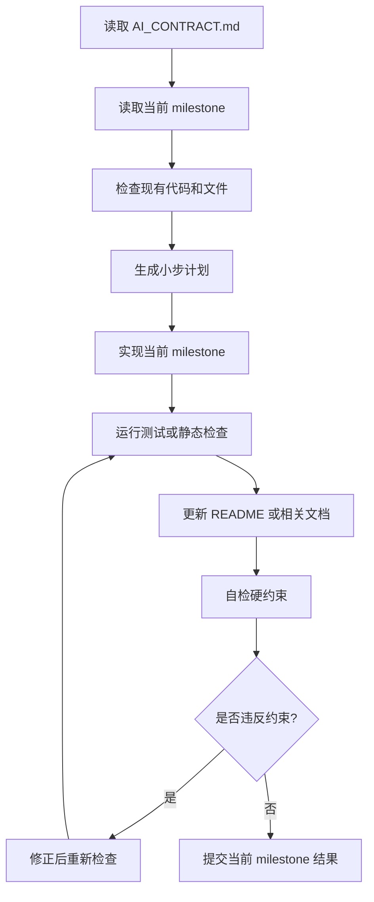

# Codex 后续开发工作流

## 开发前必读

每次开发必须按顺序阅读：

1. `docs/AI_CONTRACT.md`
2. `docs/MILESTONE.md`
3. 当前 milestone 相关文档，例如 `API_SPEC.md`、`DATA_MODEL.md`、`UI_RULES.md`

## 工作方式

- 每次只实现一个 milestone。
- 先生成简短计划，再改代码。
- 不要一次性生成整个项目。
- 不要提前实现后续 milestone。
- 不要引入与当前 milestone 无关的依赖。
- 不要把 MVP 改成聊天产品。

## 单次开发流程

## 提交粒度

- M0: 只做工程初始化。
- M1: 只做故事输入和 outline mock。
- M2: 只做主线确认。
- M3: 只做 32 页分镜脚本。
- M4: 只做漫画预览和 mock 图片。
- M5: 只做 PDF 导出。
- M6: 只做优化与测试。

## 每次自检

- 是否固定 32 页？
- 是否先确认主线再生成正文？
- 是否没有无限续写入口？
- 是否没有纯聊天式 UI？
- 是否没有纯文本 PDF 作为最终目标？
- 是否 UI 不重叠？
- 是否页面和组件拆分清晰？
- 是否仍使用 mock provider？
- 是否 README 或相关文档已更新？

## 禁止事项

- 不要一次性生成前端、后端、PDF、AI 全套实现。
- 不要跳过主线确认页。
- 不要把 Mermaid/React Flow 主线替换成长文本列表。
- 不要把漫画 PDF 简化成纯文字故事 PDF。
- 不要接入真实 AI 服务，除非进入明确的新 milestone。
- 不要安装依赖，除非当前 milestone 明确需要并得到确认。

## 推荐开发节奏

1. 小范围读代码。
2. 小范围修改。
3. 立即运行对应检查。
4. 修复明显问题。
5. 更新文档。
6. 汇报完成内容、验证结果和未做事项。
