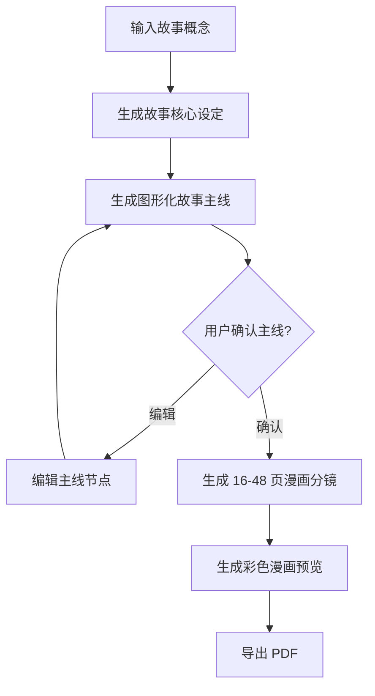

# 儿童中式/日式彩色漫画故事生成 MVP PRD

## 产品目标

本产品面向小学生，帮助用户从一个简单故事概念生成一套结构化的彩色漫画故事方案。MVP 的核心不是“聊天续写”，而是固定流程：

1. 用户输入故事概念。
2. 系统生成图形化故事主线。
3. 用户确认或编辑主线。
4. 系统生成 16-48 页故事优先漫画分镜。
5. 系统生成中式/日式彩色漫画预览。
6. 系统导出面向漫画阅读和打印的 PDF。

MVP 阶段允许使用 mock 图片占位，但产品结构、数据模型和 PDF 输出目标必须服务于后续真实漫画图像生成。

## 目标用户

- 主要用户：小学生。
- 陪伴用户：家长、老师、故事创作指导者。
- 开发阶段用户：产品负责人和开发者，用于验证本地 MVP 流程。

## MVP 范围

- 本地运行的 Web 应用。
- 故事概念输入页。
- 图形化故事主线确认页，优先使用 Mermaid 或 React Flow 思路表达故事节点关系。
- 16-48 页漫画分镜脚本生成。
- 单故事最多 96 个分镜，避免文生图消耗失控。
- 每页 1-4 个分镜。
- 每页对白保持短句、低负担阅读。
- 彩色漫画预览页，可先使用 mock 图片。
- A4 PDF 预览导出。
- 数据保存为本地 JSON。
- AI provider 使用 mock provider，接口形态预留真实 AI 接入。

## 非 MVP 范围

- 不做开放式聊天 UI。
- 不做无限续写。
- 不做多用户账号、权限、云同步。
- 不做在线支付、作品广场、社交分享。
- 不做精确 32 开印刷排版。
- 不做真实漫画图像生成服务的完整接入。
- 不做复杂安全策略自动化，当前阶段由负责人手动控制。
- 不做多语言国际化。

## 用户流程

## 验收标准

- 用户无法绕过“故事主线确认”直接生成正文或 PDF。
- 主线确认页面必须以图形化节点呈现，不允许只展示长文本。
- 系统生成的漫画脚本必须在 16-48 页之间。
- 单故事分镜总数不得超过 96 个。
- 每页分镜数量必须在 1-4 个之间。
- 每页对白不得过长，应适合小学生阅读。
- PDF 输出不得是纯文字故事，必须包含漫画页结构、分镜、图像占位或图像引用。
- UI 中正文、卡片、节点、按钮不得重叠。
- 页面必须组件化，便于后续替换 mock provider、图像生成和 PDF 方案。
- MVP 可使用 A4 PDF 预览，但文档和数据结构必须保留 32 开漫画打印扩展空间。
