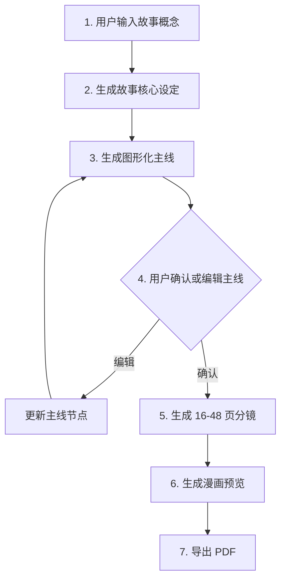

# 故事生成流程

## 总流程

## 主线节点定义

主线确认页必须包含以下 9 类节点：

| 节点 | 说明 | UI 表达 |
| --- | --- | --- |
| 开场 | 故事发生的地点、氛围和初始状态 | 起点节点 |
| 主角 | 主要角色和性格特点 | 角色节点 |
| 目标 | 主角想完成的事情 | 任务节点 |
| 伙伴 | 陪伴或帮助主角的角色 | 关系节点 |
| 阻碍 | 前进路上的困难 | 冲突节点 |
| 转折 | 事情出现新的方向 | 变化节点 |
| 危机 | 故事中最紧张的挑战 | 高潮前节点 |
| 解决 | 主角如何解决问题 | 行动节点 |
| 结局 | 故事的收束、发现和成长 | 终点节点 |

## 主线图结构

## 阶段规则

- 故事概念输入后，只能生成核心设定和主线。
- 主线未确认时，不允许生成漫画分镜。
- 漫画分镜生成后，可以进入漫画预览。
- M14 后页数由故事表达决定，但必须在 16-48 页之间，单故事最多 96 个分镜。
- 漫画预览必须包含图像占位或图像引用。
- PDF 导出必须基于漫画预览结构。

## 儿童适龄改写规则

- 危险武器、危险行为、恐吓性表达必须改写为安全冒险道具或奇幻表达。
- 示例：“猎枪”应改写为“玩具探险杖”或“木头探险杖”。
- 保留冒险感，但不鼓励现实危险行为。
